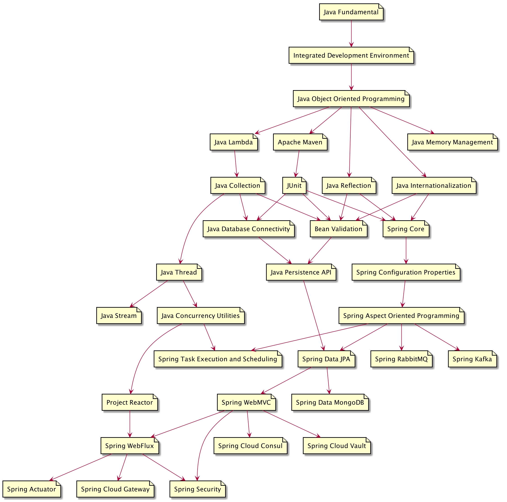

# Belajar Java

## Java Standard Edition
- [Java Fundamental](materi/java-fundamental/README.md)
- Java Object Oriented Programming
- Java Generic
- Java Lambda
- Java Internationalization
- Java Reflection
- Java Memory Management
- Java Collection
- Java Thread
- Java Database Connectivity
- Java Stream
- Java Concurrency Utilities

## Java Enterprise Edition
- Bean Validation
- Java Persistence API

## Spring Framework
- Spring Core
- Spring Configuration Properties
- Spring Aspect Oriented Programming
- Spring Task Execution and Scheduling
- Spring Data JPA
- Spring RabbitMQ
- Spring Kafka
- Spring WebMVC
- Spring Data MongoDB
- Spring WebFlux
- Spring Cloud Consul
- Spring Cloud Vault
- Spring Cloud Gateway
- Spring Actuator
- Spring Security

## Other Framework
- Integrated Development Environment 
- JUnit
- Apache Maven
- Project Reactor
